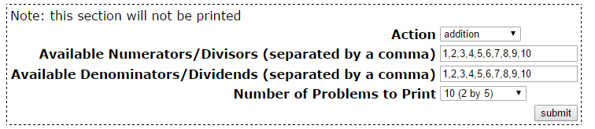
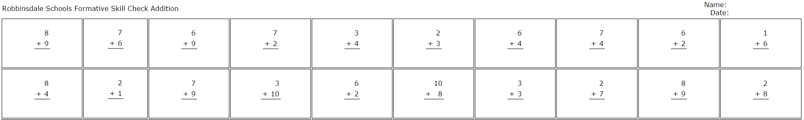
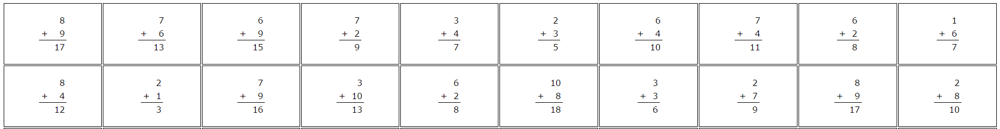

# Math Worksheet Generator
A tool for elementary school teachers to generate printable math worksheets.  This tool will generate both the student worksheet as well as the answer key for the teacher.  Each time the tool is run it will generate a new, random set of math problems.

Originally developed for the Robbinsdale School District in Minnesota.  Suggestions are welcome, as a pull requests!

#Setup

#####Step 1: Select the type of worksheet you'd like to generate
1. Addition
2. Subtraction
3. Multiplication
4. Division

#####Step 2: Select the available numerators/divisors, this is useful for creating very simple worksheets for younger students

#####Step 3: Select the available denominators/dividends

#####Step 4: Select how many problems will be created on the page

#Result

The generated file will contain a student version (no answers)

The generated file will also contain a teacher version (with answers)

 

